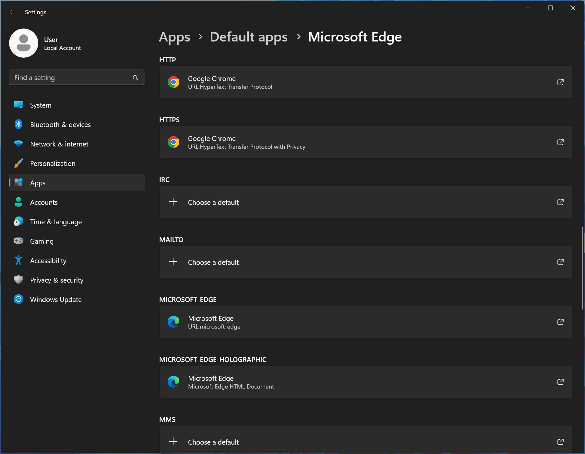

# ✅ Full Logic Flow of Selecting Default App for HTTPS in Windows

When you set which app opens `https://` links in Windows, it actually involves multiple registry paths, logic for deciding the app display name, and fallback orders.

This note fully summarizes the entire process.

---

## 🔍 Step 1: Scanning Registry Paths for Candidate Apps

When you open the "SeIect a default app for 'HTTPS' links" UI, Windows scans the following registry paths to find apps that declare support for the `https` protocol:

```reg
HKEY_LOCAL_MACHINE\SOFTWARE\Clients\StartMenuInternet\<App>\Capabilities\URLAssociations
HKEY_CURRENT_USER\SOFTWARE\Clients\StartMenuInternet\<App>\Capabilities\URLAssociations
HKEY_CLASSES_ROOT\Local Settings\Software\Microsoft\Windows\CurrentVersion\AppModel\Repository\Packages\<PackageFamilyName>\App\Capabilities\URLAssociations
```

These locations will contain values like:

```reg
https = ChromeHTML
```

➡️ `ChromeHTML` is a **ProgId**, indicating this app can handle `https://`.  
➡️ **This ProgId will be used in subsequent logic, including determining the display name and the actual execution target.**

---

### 📍 Registry Source for AppUserModelID

Next, the system will use the previously scanned `ProgId` to look up the following path to see if an AppUserModelID is specified:

```reg
HKEY_CLASSES_ROOT\<ProgId>
```

If so, you’ll see a value like:

```reg
AppUserModelID = Chrome
```

➡️ Here, `Chrome` is just an example; it corresponds to the AppUserModelID in a `.lnk` shortcut.  
➡️ The system uses this ID to match shortcuts in the Start Menu. If found, it will use the shortcut’s filename as the display name in the UI.  
➡️ **If no AppUserModelID is specified, the system falls back to the naming logic in View 2.**

---

### 📍 Shortcut Search Locations

If an AppUserModelID is specified, the system searches for matching shortcuts (.lnk) in the following locations:

```plaintext
C:\ProgramData\Microsoft\Windows\Start Menu\Programs\
%APPDATA%\Microsoft\Windows\Start Menu\Programs\
```

➡️ If a matching ID is found, the shortcut’s name is used as the UI display name.  
➡️ If no matching shortcut or Appx name is found, fallback to **View 2 naming logic** is used.

---

### 📎 Supplement:

These display names **also affect what appears when you open `shell:AppsFolder`**. This virtual folder is how Windows aggregates all registered apps. It uses AppUserModelID to determine which apps show up.

🧩 The display name logic is shared with the "Default Apps" list and is derived from:

- `.lnk` shortcuts in the Start Menu (with AppUserModelID)
    
- UWP App’s AppxManifest (containing AppUserModelID)
    

📌 **If multiple shortcuts or apps share the same AppUserModelID, `shell:AppsFolder` only displays the one with the alphabetically smallest name.**  
➡️ This is because Windows treats them as multiple shortcuts to the same app and avoids duplicate entries.  
➡️ This explains why some shortcuts exist but don’t appear in `shell:AppsFolder`.

🪄 The result is: across "Choose default apps", Start Menu, search results, and `shell:AppsFolder`, they **all share the same display name decision logic**, primarily based on AppUserModelID + shortcut/Appx-defined names.


🧭 However, **once you set a default app for `https://`**, the system switches to the **View 2 logic**, which is driven by the assigned **ProgId**.  
➡️ This means: **the display name you see before setting (based on shortcuts / AppUserModelID)** may **differ from the one you see after setting (based on ProgId)**.  
➡️ Example: Before setting, you might see `"Google Chrome - User"` (from shortcut name), but after setting, it shows `"Google Chrome"` (from `ProgId\ApplicationName` or exe metadata).


---

## ⚙️ View 2: ProgId View (Actual Association After Setting)

Once a user selects an app as the default handler for `https://`, Windows writes the following:

```reg
HKEY_CURRENT_USER\Software\Microsoft\Windows\Shell\Associations\UrlAssociations\https\UserChoice
ProgId = ChromeHTML
```

This `ChromeHTML` ProgId, previously scanned, is used to bind the application.

---

### 📌 View 2 Display Name Decision Order:

The display name for View 2 is derived from the stored `ProgId` (e.g., `ChromeHTML`). The system queries the following in order to determine the display name:

---

1️⃣ `ApplicationName` Registry Value (highest priority):

Location:

```reg
HKEY_CLASSES_ROOT\<ProgId>\Application
```

Example:

```reg
HKEY_CLASSES_ROOT\ChromeHTML\Application
ApplicationName = Google Chrome
```

➡️ If this value exists, it is used directly as the display name.

---

2️⃣ Fallback: MuiCache Cache

Before this step, the system first reads the actual executable path for the `ProgId`:

```reg
HKEY_CLASSES_ROOT\<ProgId>\shell\open\command
```

Example:

```reg
HKEY_CLASSES_ROOT\ChromeHTML\shell\open\command
(Default) = "C:\Program Files\Google\Chrome\Application\chrome.exe" -- "%1"
```

➡️ The system extracts the actual `.exe` path and uses it to query this cache:

```reg
HKEY_CURRENT_USER\Software\Classes\Local Settings\Software\Microsoft\Windows\Shell\MuiCache
```

Example:

```text
C:\Program Files\Google\Chrome\Application\chrome.exe.FriendlyAppName = Google Chrome
```

➡️ If `ApplicationName` is missing, the cached friendly name here will be used.

---

3️⃣ Fallback: `.exe`’s `FileDescription`

If not found in MuiCache, the system directly reads the EXE’s VERSIONINFO:

```text
C:\Program Files\Google\Chrome\Application\chrome.exe
→ FileDescription = Google Chrome
```

---

4️⃣ No Fallback:

If none of the above can be found, the app **won’t appear in the default apps list**.

---

## 🚀 Actual Execution Target

Once `ChromeHTML` (ProgId) is selected, Windows uses the following path to execute the corresponding program:

```reg
HKEY_CLASSES_ROOT\<ProgId>\shell\open\command
```

➡️ This defines the executable path and its parameters, such as:

```reg
(Default) = "C:\Program Files\Google\Chrome\Application\chrome.exe" -- "%1"
```

---

## 🔧 Tool: Check AppUserModelID of a Shortcut

You can use PowerShell to check if a `.lnk` file has an AppUserModelID:

```powershell
function Get-AppUserModelID {
    param([string]$LnkPath)

    if (-not (Test-Path $LnkPath)) {
        Write-Host "❗ File not found: $LnkPath"
        return
    }

    $shell = New-Object -ComObject Shell.Application
    $folder = $shell.Namespace((Split-Path $LnkPath))
    $item = $folder.ParseName((Split-Path $LnkPath -Leaf))
    $appId = $item.ExtendedProperty("System.AppUserModel.ID")

    if ($appId) {
        "✅ AppUserModelID: $appId"
    } else {
        "❌ This shortcut does not have an AppUserModelID set"
    }
}
```
